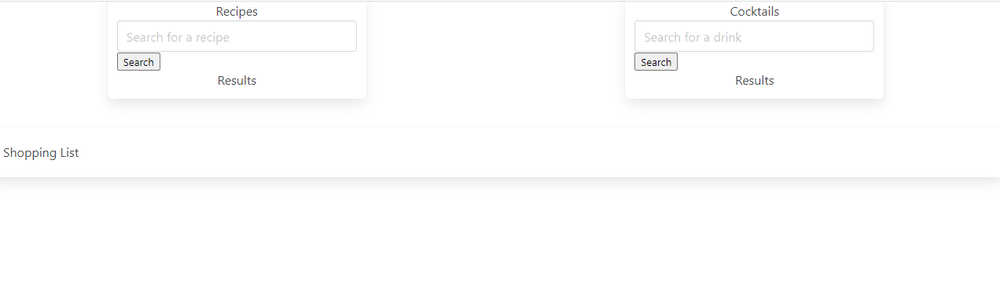
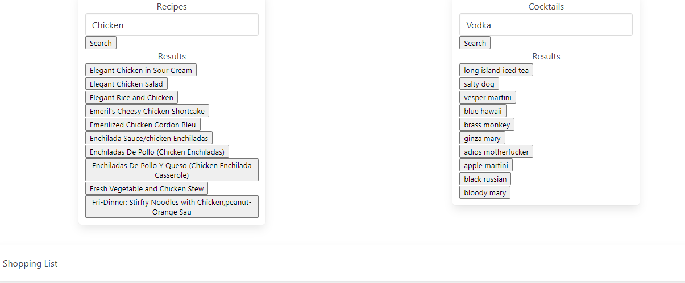

# Eat-Drink-Be-Merry Food and Drink Selector

## Description

After a long stressful day at the office I want nothing more than to be able to come home and enjoy a stress free evening.  Few things can add additional stress to your day like trying to decide what to enjoy for dinner.  With the Eat-Drink-Be-Merry Food and Drink Selector one can simply type in an ingredient and a cocktail base and selections will be presented to you.

If you are a more proactive type the App has a built in "Shopping List" feature that will allow you to choose what you'd like to eat in advance and the app will pre-populate a shopping list which will make your grocery runs more streamlined and get you in and out even quicker.

The food and drink selection process is provided using the API Ninjas food and drink APIs.

## Installation

The beauty of this App is that there is no installation necessary.  It was designed with ease and function in mind.  One can simply launch the site from:

https://wir3s.github.io/eat-drink-be-merry/

And then go to town deciding what they want to imbibe on as well as satisfy their dinner needs.

## Usage

Simply launch the site by navigating to:  https://wir3s.github.io/eat-drink-be-merry/

Once on the site, you are ready to go.  Begin by entering a food ingredient in the food recipe list and use the 'Search' button to populate a list of choices.  By clicking on one of the choice buttons you'll see the recipe pop up in a main screen modal that will give you the serving size, ingredients, and cooking instructions.  If this choice is what you are looking for simply press the 'Add to Grocery List' button and the ingredients will be added to the shopping list at the bottom of the page.  

If that food item doesn't sound like the option for you, you can press the 'Cancel' button and go back to the other options in the list.

If none of the food items feel right, delete your initial selection and try again with a new food item.

Once your food item is selected, you are able to make a similar selection for your cocktail of choice.  

Begin by typing your alcohol or mixer into the search bar and click 'Search' to populate your choices.  When you've found what you're looking for you can click on the beverage button of choice.

Once chosen, you'll be provided a similar modal to the food choices, however, you will be presented with your beverage ingredients and instructions on how to build your drink.  When you find what you're looking for, you can then use the 'Add to Grocery List' button and add those ingredients to your shopping list.

If the drink is not to your choosing you can hit the 'Cancel' button and try again.

See below for Screenshots of our site:

## Credits

T - Taylor Sample https://github.com/Taysa86 
A - Andre Bessette https://github.com/Wir3s
S - Sean McGuire https://github.com/swmcguire 
C - Colin Bradshaw https://github.com/lilcguy 

APIs Used:

https://api-ninjas.com/api/recipe - API used for Food Recipes, Ingredients, and Instructions

https://api-ninjas.com/api/cocktail - API used for Drink Names, Ingredients, and Preparation Instructions

## License

MIT License

Copyright (c) 2022 TASCMasters

Permission is hereby granted, free of charge, to any person obtaining a copy
of this software and associated documentation files (the "Software"), to deal
in the Software without restriction, including without limitation the rights
to use, copy, modify, merge, publish, distribute, sublicense, and/or sell
copies of the Software, and to permit persons to whom the Software is
furnished to do so, subject to the following conditions:

The above copyright notice and this permission notice shall be included in all
copies or substantial portions of the Software.

THE SOFTWARE IS PROVIDED "AS IS", WITHOUT WARRANTY OF ANY KIND, EXPRESS OR
IMPLIED, INCLUDING BUT NOT LIMITED TO THE WARRANTIES OF MERCHANTABILITY,
FITNESS FOR A PARTICULAR PURPOSE AND NONINFRINGEMENT. IN NO EVENT SHALL THE
AUTHORS OR COPYRIGHT HOLDERS BE LIABLE FOR ANY CLAIM, DAMAGES OR OTHER
LIABILITY, WHETHER IN AN ACTION OF CONTRACT, TORT OR OTHERWISE, ARISING FROM,
OUT OF OR IN CONNECTION WITH THE SOFTWARE OR THE USE OR OTHER DEALINGS IN THE
SOFTWARE.

---

## Features

--List upcoming features here? 

--NOTES - Do we want a table of contents? 
